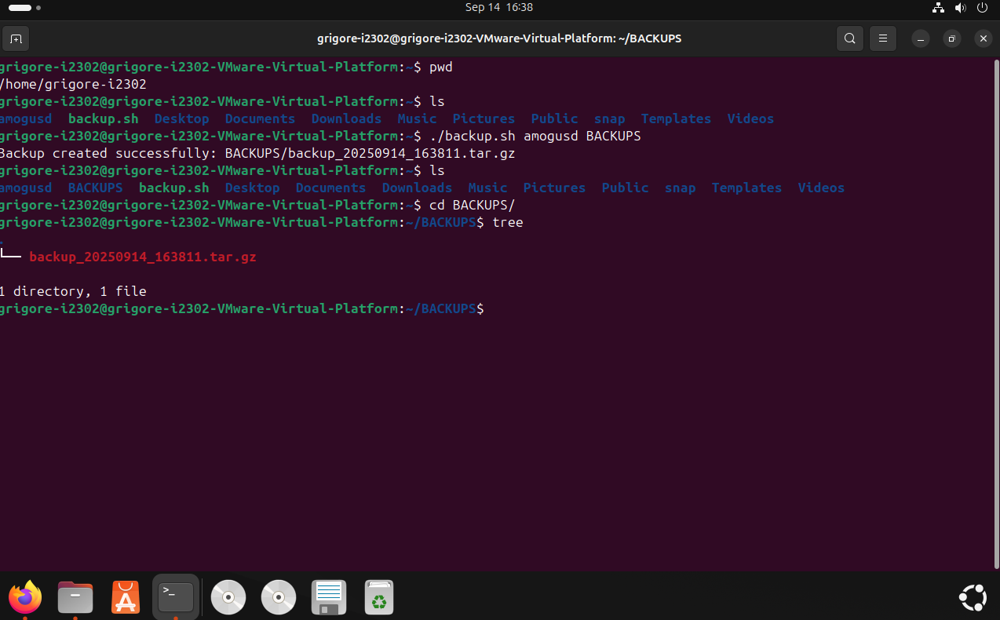

# IW01: Writing a Simple Shell Script for Task Automation
---
### Student: Grigore Zaica (I2302)
---
## Objective
Learn to create and execute simple Shell scripts to automate routine tasks in the Linux operating system.

## Task
Automate one of the following tasks using a Shell script:

> __Creating a backup of an important directory:__
  - The script should be named `backup.sh`;
  - The script should take two arguments: `the path to the directory to backup` and `the path to the directory to save the backup`;
  - The second argument should be `optional` and default to the directory backup;
  - The script should create a `tar.gz archive` with the `current date in thefilename`;
  - The `script should check` that the specified directories exist and outputappropriate error messages.

## Usage
Exist few variants how to recreate this script at your machine:
- Copy my file from GitHub
- DIY the script following the instructions below

### Instructions How to Run the Script
1. Create the script using __Terminal__:
    1. Use command `touch backup.sh` to create script and then modify it through GUI
    2. OR write `nano backup.sh` and copypaste it in terminal, press `CTRL+O` to save the script. `Enter` and then `CTRL+X` to exit.
2. In __Terminal__ write `./backup.sh directory-to-backup directory-where-to-backup-(optional)`

Directory prepared for backup must exist, however the second optional directory will be created automatically if its non-existing in the specified location.

## Screenshots

# Conclusion
The `backup.sh` script successfully automates the creation of a compressed `tar.gz` backup of a specified directory on __Ubuntu LTS__. It takes a mandatory source directory and an optional backup directory (defaulting to `/backup`), incorporates error handling for nonexistent directories and failed operations, and names backups with a timestamp. The script was created, made executable, executed, and verified as per the task requirements. This project demonstrates fundamental Bash scripting skills, including argument handling, conditional checks, and file operations, providing a reusable tool for routine backup tasks in Linux.