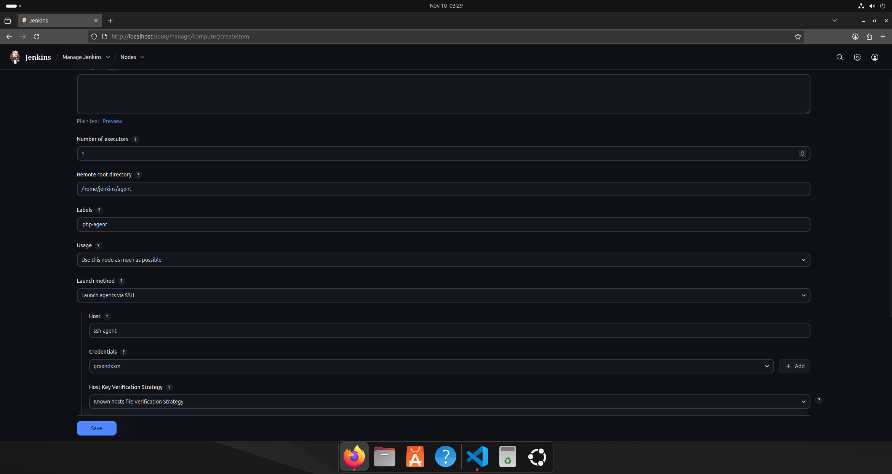
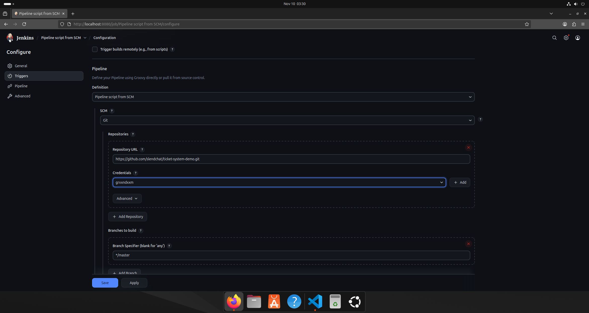

# Lab 04: Jenkins Configuration for DevOps Task Automation

## Project Description

This project demonstrates the setup of Jenkins infrastructure using Docker Compose for automating Continuous Integration and Continuous Delivery (CI/CD) processes. The configuration includes Jenkins Controller and SSH Agent with PHP support for executing testing tasks.

## Project Structure

```
lab04/
├── docker-compose.yml
├── Dockerfile
├── .env
├── Jenkinsfile
├── secrets/
│   ├── jenkins_agent_ssh_key
│   └── jenkins_agent_ssh_key.pub
└── README.md
```

## Prerequisites

- Docker installed
- Docker Compose installed
- Git for version control
- Access to a PHP project repository

## Installation and Configuration

### 1. Project Setup

```bash
# Create project folder
mkdir lab04
cd lab04

# Create directory structure
mkdir secrets
```

### 2. Generate SSH Keys

```bash
cd secrets
ssh-keygen -t rsa -b 4096 -f jenkins_agent_ssh_key -N ""
cd ..
```

### 3. Environment Configuration

Create a `.env` file in the project root and add the public key:

```bash
echo "JENKINS_AGENT_SSH_PUBKEY=$(cat secrets/jenkins_agent_ssh_key.pub)" > .env
```

### 4. Infrastructure Deployment

```bash
# Start all services
docker-compose up -d

# View Jenkins logs
docker-compose logs -f jenkins-controller
```

## Jenkins Configuration

### Initial Setup

1. Open Jenkins in your browser: http://localhost:8080

2. Retrieve the initial admin password:
```bash
docker-compose logs jenkins-controller | grep "Please use the following password"
```

3. Complete the initial setup wizard:
   - Install recommended plugins
   - Create administrator account

### SSH Agent Configuration

1. **Add SSH Credentials**
   - Navigate to Manage Jenkins > Manage Credentials
   - Add new credentials:
     - Kind: SSH Username with private key
     - Username: jenkins
     - Private Key: content of `secrets/jenkins_agent_ssh_key` file

2. **Configure Jenkins Node**
   - Manage Jenkins > Manage Nodes and Clouds > New Node
   - Name: `ssh-agent1`
   - Type: Permanent Agent
   - Settings:
     - Remote root directory: `/home/jenkins/agent`
     - Labels: `php-agent`
     - Launch method: Launch agents via SSH
     - Host: `ssh-agent`
     - Credentials: select the added SSH key

## Pipeline Creation

### 1. Jenkins Project Setup

1. Create a new Pipeline item
2. In Pipeline section configure:
   - Definition: Pipeline script from SCM
   - SCM: Git
   - Repository URL: Your PHP repository URL
   - Script Path: Jenkinsfile




### 2. Jenkinsfile

Create a `Jenkinsfile` in your PHP project root:

```groovy
pipeline {
    agent {
        label 'php-agent'
    }
    
    stages {        
        stage('Repository Clone') {
            steps {
                echo 'Cloning PHP project...'
                git 'https://github.com/your-username/your-php-project.git'
            }
        }
        
        stage('Dependency Installation') {
            steps {
                echo 'Installing Composer dependencies...'
                sh 'composer install --no-dev --optimize-autoloader'
            }
        }
        
        stage('Testing') {
            steps {
                echo 'Running PHPUnit tests...'
                sh 'vendor/bin/phpunit --testdox'
            }
        }
    }
    
    post {
        always {
            echo 'Pipeline completed.'
            cleanWs()
        }
        success {
            echo 'All stages completed successfully!'
        }
        failure {
            echo 'Pipeline execution failed!'
        }
    }
}
```

## Service Management

```bash
# Start all services
docker-compose up -d

# Stop all services
docker-compose down

# Restart specific service
docker-compose restart jenkins-controller

# Check status
docker-compose ps

# View logs
docker-compose logs -f ssh-agent
```

## Questions and Answers

### Advantages of Using Jenkins for DevOps Task Automation

- **Open Source** - Free to use with extensive customization capabilities
- **Rich Plugin Ecosystem** - Over 1,500 plugins for integration with various tools and technologies
- **Scalability** - Support for distributed architecture with multiple agents for parallel task execution
- **Flexibility** - Support for multiple programming languages, build tools, and deployment technologies
- **Pipeline-as-Code** - Ability to define pipelines as code with version control and code review capabilities

### Other Types of Jenkins Agents

- **Docker Agent** - Execute tasks in isolated Docker containers with pre-installed dependencies
- **Kubernetes Agent** - Dynamic pod creation in Kubernetes clusters for task execution
- **Java Web Start Agent** - Agent connection via JNLP (Java Network Launch Protocol)
- **Windows Agent** - Specialized agents for Windows environment task execution
- **Cloud Agents** - Agents deployed on-demand in cloud providers (AWS, Azure, GCP)

### Common Setup Issues and Solutions

> **`Issue 1` SSH Agent Connection Failures to Controller**

`Solution` Verify SSH key generation correctness, ensure public key is properly set in environment variables, and private key is correctly added to Jenkins credentials.

> **`Issue 2` Missing Required Tools in Agent**

`Solution` Extend the base Dockerfile image with installation of additional packages required for specific pipeline tasks.

> **`Issue 3` Volume Permission Issues**

`Solution` Configure proper access permissions in Dockerfile and verify volume settings in docker-compose.yml.

> **`Issue 4` PHP Test Execution Errors in Container**

`Solution` Ensure all necessary PHP extensions and dependencies are available in the agent image, verify PHP versions and project compatibility.

## Conclusion

This laboratory work successfully configured a distributed Jenkins infrastructure using Docker Compose, created and tested a CI/CD pipeline for a PHP project. The implemented configuration demonstrates fundamental principles of DevOps process automation and can be extended to address more complex continuous integration and delivery tasks.

## Additional Resources

- [Official Jenkins Documentation](https://www.jenkins.io/doc/)
- [Docker Compose Documentation](https://docs.docker.com/compose/)
- [Jenkins Pipeline Syntax](https://www.jenkins.io/doc/book/pipeline/syntax/)