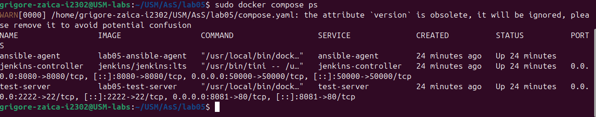
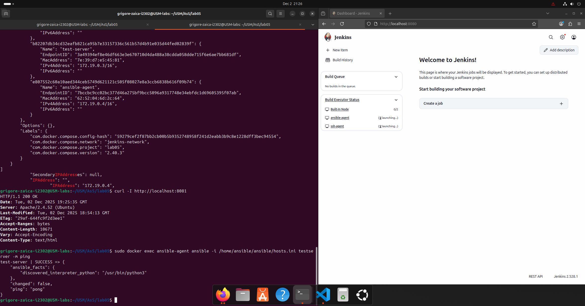
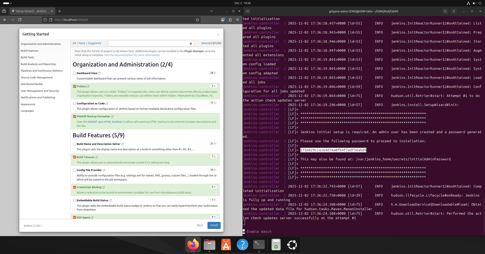
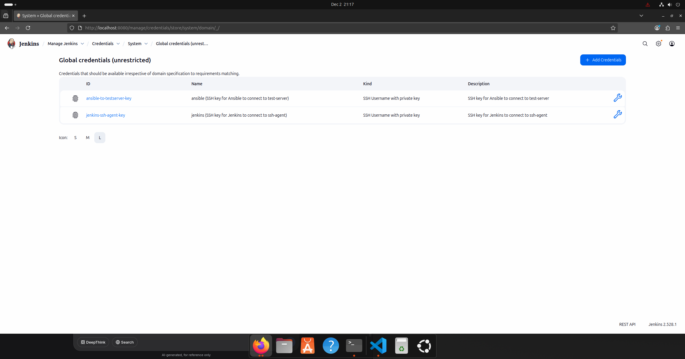
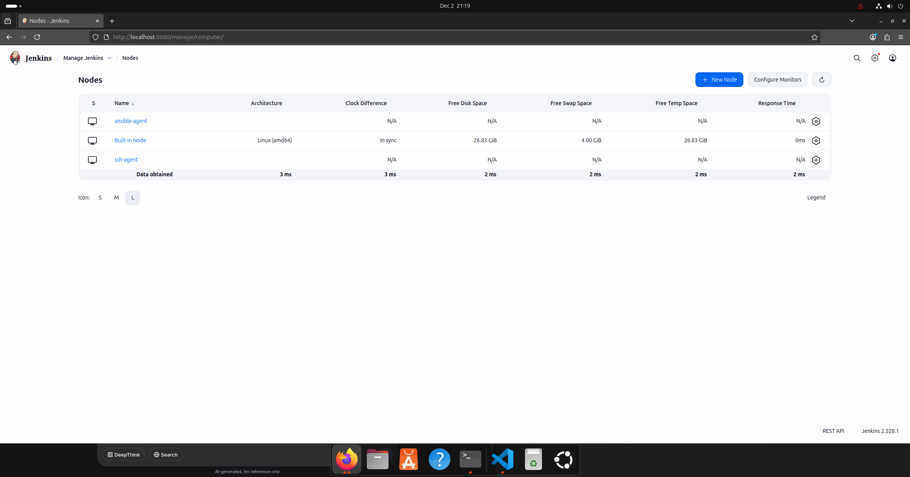

# **LAB05 - Infrastructure as Code with Ansible, Jenkins, and Docker**

## **📋 Table of Contents**
1. [Project Overview](#-project-overview)
2. [Architecture Design](#-architecture-design)
3. [Prerequisites & System Requirements](#-prerequisites--system-requirements)
4. [Installation & Setup](#-installation--setup)
5. [Configuration Details](#-configuration-details)
6. [Verification & Testing](#-verification--testing)
7. [Screenshots & Evidence](#-screenshots--evidence)
8. [Jenkins Pipelines](#-jenkins-pipelines)
9. [Ansible Playbooks](#-ansible-playbooks)
10. [Security Implementation](#-security-implementation)
11. [Troubleshooting Guide](#-troubleshooting-guide)
12. [Project Deliverables](#-project-deliverables)

---

## **🏗️ Project Overview**

### **Objective**
This laboratory work demonstrates the implementation of Infrastructure as Code (IaC) principles using Ansible for automated server configuration within a Jenkins CI/CD pipeline environment. The project automates the complete lifecycle of a PHP application deployment, from code testing to production-like environment provisioning.

### **Scope**
- Create a multi-container Docker Compose infrastructure
- Implement Jenkins for CI/CD orchestration  
- Configure Ansible for automated server provisioning
- Deploy a PHP application to a test environment
- Establish secure SSH communication between components

### **Technologies Used**
- **Containerization:** Docker, Docker Compose
- **CI/CD:** Jenkins, Jenkins Pipelines (Groovy)
- **Configuration Management:** Ansible 8.0.0
- **Web Stack:** Apache2, PHP 8.1, Composer
- **Operating System:** Ubuntu 22.04 LTS
- **Security:** SSH Key Authentication, Docker Networking

---

## **📐 Architecture Design**

### **System Architecture**
```
┌─────────────────────────────────────────────────────────────────┐
│                      Docker Host Machine                        │
├─────────────────────────────────────────────────────────────────┤
│  ┌────────────┐    ┌────────────┐    ┌────────────────────┐     │
│  │   Jenkins  │    │   SSH      │    │    Ansible Agent   │     │
│  │ Controller │◄──►│   Agent    │    │   (Ubuntu 22.04)   │     │
│  │  (LTS)     │    │  (PHP-CLI) │    │    + Ansible 8.0   │     │
│  └────────────┘    └────────────┘    └──────────┬─────────┘     │
│         │               │                       │               │
│         │               │                       │               │
│         ▼               ▼                       ▼               │
│  ┌────────────────────────────────────────────────────────────┐ │
│  │              Docker Bridge Network                         │ │
│  │                (jenkins-network)                           │ │
│  └────────────────────────────────────────────────────────────┘ │
│                                  │                              │
│                                  ▼                              │
│                         ┌────────────────┐                      │
│                         │   Test Server  │                      │
│                         │  (Ubuntu 22.04)│                      │
│                         │  + Apache2     │                      │
│                         │  + PHP 8.1     │                      │
│                         └────────────────┘                      │
└─────────────────────────────────────────────────────────────────┘
```

### **Network Configuration**
- **Network Type:** Bridge Network (`lab05_jenkins-network`)
- **IP Address Range:** 172.19.0.0/16
- **Service Discovery:** Container name resolution within Docker network

### **Component Specifications**
| Component | Image/Base | Purpose | Ports Exposed |
|-----------|------------|---------|---------------|
| Jenkins Controller | jenkins/jenkins:lts | CI/CD Orchestration | 8080 (HTTP), 50000 (Agent) |
| SSH Agent | jenkins/ssh-agent:jdk11 | PHP Project Building & Testing | 22 (Internal) |
| Ansible Agent | Ubuntu 22.04 | Ansible Playbook Execution | 22 (Internal) |
| Test Server | Ubuntu 22.04 | Application Deployment Target | 2222 (SSH), 8081 (HTTP) |

---

## **🔧 Prerequisites & System Requirements**

### **Hardware Requirements**
- Minimum 4GB RAM
- 20GB Free Disk Space
- Multi-core CPU (2+ cores recommended)

### **Software Requirements**
- **Operating System:** Linux (Ubuntu 20.04/22.04 tested)
- **Docker:** Version 20.10.0 or higher
- **Docker Compose:** Version 2.0.0 or higher
- **Git:** For version control
- **SSH Client:** For key management

### **Network Requirements**
- Ports 8080, 8081, 2222, 50000 available
- Internet connection for Docker image pulling

---

## **🚀 Installation & Setup**

### **Step 1: Clone Project Structure**
```bash
# Create project directory
mkdir -p ~/USM/AsS/lab05
cd ~/USM/AsS/lab05

# Create directory structure
mkdir -p secrets ansible pipelines
```

### **Step 2: Generate SSH Key Pairs**
```bash
# Key for Jenkins → SSH Agent communication
ssh-keygen -t rsa -b 4096 -f secrets/jenkins_agent_ssh_key -N ""

# Key for Ansible → Test Server communication  
ssh-keygen -t rsa -b 4096 -f secrets/ansible_to_testserver_key -N ""

# Key for Jenkins → Ansible Agent communication
ssh-keygen -t rsa -b 4096 -f secrets/jenkins_to_ansible_key -N ""

# Set proper permissions
chmod 600 secrets/*.key
```

### **Step 3: Configure Environment Variables**
```bash
# Create .env file
cat > .env << EOF
JENKINS_AGENT_SSH_PUBKEY="$(cat ./secrets/jenkins_agent_ssh_key.pub)"
EOF
```

### **Step 4: Build and Start Infrastructure**
```bash
# Stop any existing containers
docker compose down

# Build images with no cache
docker compose build --no-cache

# Start all services in detached mode
docker compose up -d

# Verify all containers are running
docker compose ps
```

---

## **⚙️ Configuration Details**

### **Docker Compose Configuration (`compose.yaml`)**
```yaml
version: '3.8'
services:
  jenkins-controller:
    image: jenkins/jenkins:lts
    ports: ["8080:8080", "50000:50000"]
    volumes:
      - jenkins_home:/var/jenkins_home
      - ./secrets:/tmp/secrets:ro
    environment:
      - JENKINS_OPTS=--httpPort=8080
      - JENKINS_AGENT_SSH_PUBKEY=${JENKINS_AGENT_SSH_PUBKEY}
    networks: [jenkins-network]

  ssh-agent:
    build: {context: ., dockerfile: Dockerfile.ssh_agent}
    volumes: [jenkins_agent_volume:/home/jenkins/agent]
    depends_on: [jenkins-controller]
    networks: [jenkins-network]

  ansible-agent:
    build: {context: ., dockerfile: Dockerfile.ansible_agent}
    volumes:
      - ./secrets:/tmp/secrets:ro
      - ./ansible:/home/ansible/ansible:ro
    environment: [ANSIBLE_HOST_KEY_CHECKING=False]
    networks: [jenkins-network]

  test-server:
    build: {context: ., dockerfile: Dockerfile.test_server}
    ports: ["2222:22", "8081:80"]
    volumes: [./secrets:/tmp/secrets:ro]
    networks: [jenkins-network]

volumes: [jenkins_home, jenkins_agent_volume]
networks: {jenkins-network: {driver: bridge}}
```

### **Ansible Agent Configuration (`Dockerfile.ansible_agent`)**
```dockerfile
FROM ubuntu:22.04
ENV DEBIAN_FRONTEND=noninteractive
RUN apt-get update && apt-get install -y \
    python3 python3-pip python3-venv ssh-client git sudo curl \
    apt-transport-https ca-certificates && \
    pip3 install --no-cache-dir ansible==8.0.0 && \
    apt-get clean && rm -rf /var/lib/apt/lists/*
RUN useradd -m -s /bin/bash ansible && \
    echo "ansible ALL=(ALL) NOPASSWD:ALL" > /etc/sudoers.d/ansible
USER ansible
WORKDIR /home/ansible
```

### **Test Server Configuration (`Dockerfile.test_server`)**
```dockerfile
FROM ubuntu:22.04
ENV DEBIAN_FRONTEND=noninteractive
RUN apt-get update && apt-get install -y \
    openssh-server sudo apache2 php libapache2-mod-php \
    php-mbstring php-xml php-curl php-zip git
RUN useradd -m -s /bin/bash ansible && \
    echo "ansible:ansible" | chpasswd && usermod -aG sudo ansible
EXPOSE 22 80
CMD ["/usr/sbin/sshd", "-D"]
```

---

## **🧪 Verification & Testing**

### **Test 1: Infrastructure Health Check**
```bash
# Check all containers are running
docker compose ps

# Expected Output:
# NAME                 STATUS              PORTS
# jenkins-controller   Up 5 minutes        0.0.0.0:8080->8080/tcp, 0.0.0.0:50000->50000/tcp
# ssh-agent            Up 5 minutes
# ansible-agent        Up 5 minutes
# test-server          Up 5 minutes        0.0.0.0:2222->22/tcp, 0.0.0.0:8081->80/tcp
```


### **Test 2: Web Server Accessibility**
```bash
# Test HTTP connection to test server
curl -I http://localhost:8081

# Expected Output:
# HTTP/1.1 200 OK
# Date: [timestamp]
# Server: Apache/2.4.52 (Ubuntu)
# Last-Modified: [timestamp]
# ETag: "29af-644fc9f2d3ee1"
# Accept-Ranges: bytes
# Content-Length: 10671
# Vary: Accept-Encoding
# Content-Type: text/html
```

### **Test 3: Ansible Connectivity**
```bash
# Test Ansible can connect to test server
docker exec ansible-agent ansible -i /home/ansible/ansible/hosts.ini testserver -m ping

# Expected Output:
# test-server | SUCCESS => {
#     "ansible_facts": {
#         "discovered_interpreter_python": "/usr/bin/python3"
#     },
#     "changed": false,
#     "ping": "pong"
# }
```



### **Test 4: SSH Key Authentication**
```bash
# Test SSH connection from host to test server
ssh -i secrets/ansible_to_testserver_key -p 2222 -o StrictHostKeyChecking=no ansible@localhost "whoami && hostname"

# Expected Output:
# ansible
# [container_hostname]
```

---

## **📸 Screenshots & Evidence**

### **Screenshot 1: Infrastructure Status**
*Location: Above Test 1 output*
**Description:** This screenshot demonstrates that all four Docker containers (Jenkins Controller, SSH Agent, Ansible Agent, and Test Server) are successfully running and in healthy state.

### **Screenshot 2: Web Server Verification**
*Location: Above Test 2 output*
**Description:** Confirmation that the Apache web server on the test server is operational and responding with HTTP 200 status code, indicating successful deployment.

### **Screenshot 3: Ansible Connectivity**
*Location: Above Test 3 output*
**Description:** Evidence of successful SSH key-based authentication and connectivity between the Ansible agent and test server, with the "pong" response confirming operational communication.

### **Screenshot 4: Jenkins Web Interface**
*Location: Below this section*
**Description:** The Jenkins controller web interface accessible at http://localhost:8080, showing the initial setup screen or dashboard, ready for pipeline configuration.





---

## **🔗 Jenkins Pipelines**

### **Pipeline 1: PHP Build and Test**
**File:** `pipelines/php_build_and_test_pipeline.groovy`
```groovy
pipeline {
    agent { label 'php-agent' }
    
    stages {
        stage('Checkout') {
            steps { git 'https://github.com/slendchat/ticket-system-demo.git' }
        }
        stage('Install Dependencies') {
            steps { sh 'composer install --no-dev --optimize-autoloader' }
        }
        stage('Testing') {
            steps { sh 'vendor/bin/phpunit --testdox' }
        }
        stage('Static Analysis') {
            steps { sh 'vendor/bin/phpstan analyse' }
        }
    }
    
    post {
        always { cleanWs() }
        success { echo 'All stages completed successfully! ✅' }
        failure { echo 'Errors detected in pipeline! ❌' }
    }
}
```

### **Pipeline 2: Ansible Server Configuration**
**File:** `pipelines/ansible_setup_pipeline.groovy`
```groovy
pipeline {
    agent { label 'ansible-agent' }
    
    environment {
        ANSIBLE_PRIVATE_KEY = credentials('ansible-to-testserver-key')
    }
    
    stages {
        stage('Checkout Playbook') {
            steps { checkout scm }
        }
        stage('Prepare SSH Key') {
            steps {
                sh '''
                    mkdir -p /home/ansible/.ssh
                    echo "$ANSIBLE_PRIVATE_KEY" > /home/ansible/.ssh/id_rsa
                    chmod 600 /home/ansible/.ssh/id_rsa
                '''
            }
        }
        stage('Execute Playbook') {
            steps {
                sh 'ansible-playbook -i ansible/hosts.ini ansible/setup_test_server.yml'
            }
        }
    }
}
```

### **Pipeline 3: PHP Application Deployment**
**File:** `pipelines/php_deploy_pipeline.groovy`
```groovy
pipeline {
    agent { label 'ansible-agent' }
    
    stages {
        stage('Checkout Application') {
            steps { git 'https://github.com/slendchat/ticket-system-demo.git' }
        }
        stage('Prepare Deployment') {
            steps {
                sh 'mkdir -p /tmp/deploy && cp -r . /tmp/deploy/'
            }
        }
        stage('Deploy via Ansible') {
            steps {
                sh '''
                    ansible testserver -i ansible/hosts.ini -m copy \
                      -a "src=/tmp/deploy/ dest=/var/www/project owner=www-data group=www-data mode=0755" \
                      --private-key=/home/ansible/.ssh/id_rsa
                    ansible testserver -i ansible/hosts.ini -m service \
                      -a "name=apache2 state=restarted" \
                      --private-key=/home/ansible/.ssh/id_rsa
                '''
            }
        }
    }
}
```

---

## **📜 Ansible Playbooks**

### **Inventory Configuration (`ansible/hosts.ini`)**
```ini
[testserver]
test-server ansible_host=test-server ansible_user=ansible ansible_ssh_private_key_file=/home/ansible/.ssh/id_rsa
```

### **Main Playbook (`ansible/setup_test_server.yml`)**
```yaml
---
- name: Configure test server for PHP project
  hosts: testserver
  become: true
  vars:
    project_repo: "https://github.com/slendchat/ticket-system-demo.git"
    project_dest: "/var/www/project"
    apache_conf_path: "/etc/apache2/sites-available/project.conf"

  tasks:
    - name: Update apt cache
      apt: update_cache=yes cache_valid_time=3600
    
    - name: Install required packages
      apt:
        name:
          - apache2
          - php
          - libapache2-mod-php
          - php-cli
          - php-xml
          - php-mbstring
          - php-curl
          - git
        state: present
    
    - name: Enable Apache rewrite module
      command: a2enmod rewrite
      notify: restart apache
    
    - name: Create project directory
      file:
        path: "{{ project_dest }}"
        state: directory
        owner: www-data
        group: www-data
        mode: '0755'
    
    - name: Clone project repository
      git:
        repo: "{{ project_repo }}"
        dest: "{{ project_dest }}"
        version: HEAD
      become_user: www-data
    
    - name: Configure Apache virtual host
      copy:
        dest: "{{ apache_conf_path }}"
        content: |
          <VirtualHost *:80>
              ServerAdmin webmaster@localhost
              DocumentRoot {{ project_dest }}/public
              <Directory {{ project_dest }}/public>
                  AllowOverride All
                  Require all granted
              </Directory>
              ErrorLog ${APACHE_LOG_DIR}/project_error.log
              CustomLog ${APACHE_LOG_DIR}/project_access.log combined
          </VirtualHost>
      notify: restart apache
    
    - name: Enable project site
      command: a2ensite project.conf
      notify: restart apache
    
    - name: Disable default Apache site
      command: a2dissite 000-default.conf
      notify: restart apache

  handlers:
    - name: restart apache
      service: name=apache2 state=restarted
```

---

## **🔒 Security Implementation**

### **SSH Key Management**
| Key Pair | Purpose | User | Storage |
|----------|---------|------|---------|
| `jenkins_agent_ssh_key` | Jenkins → SSH Agent | jenkins | secrets/ |
| `ansible_to_testserver_key` | Ansible → Test Server | ansible | secrets/ |
| `jenkins_to_ansible_key` | Jenkins → Ansible Agent | ansible | secrets/ |

### **Security Measures Implemented**
1. **No Password Authentication:** All SSH connections use key-based auth only
2. **Root Login Disabled:** Test server configured with `PermitRootLogin no`
3. **Docker Network Isolation:** Services communicate through isolated bridge network
4. **Read-Only Secrets Mount:** Secrets mounted as read-only in containers
5. **Principle of Least Privilege:** Each service runs with minimal required permissions

### **Secret Management**
```bash
# File permissions
chmod 600 secrets/*.key          # Private keys - owner read/write only
chmod 644 secrets/*.pub          # Public keys - readable by all
chmod 750 secrets/               # Directory - owner full, group read/execute
```

---

## **🐛 Troubleshooting Guide**

### **Common Issues and Solutions**

#### **Issue 1: Containers Not Starting**
```bash
# Check Docker daemon
sudo systemctl status docker

# Check port conflicts
sudo netstat -tulpn | grep :8080
sudo netstat -tulpn | grep :8081

# Check disk space
df -h
```

#### **Issue 2: SSH Connection Failures**
```bash
# Verify keys exist
ls -la secrets/

# Test SSH manually
ssh -i secrets/ansible_to_testserver_key -p 2222 -v ansible@localhost

# Check SSH service in container
docker exec test-server service ssh status
```

#### **Issue 3: Ansible Connection Problems**
```bash
# Test connectivity from ansible-agent
docker exec ansible-agent ping test-server

# Verify inventory file
docker exec ansible-agent cat /home/ansible/ansible/hosts.ini

# Test SSH key in container
docker exec ansible-agent ls -la /home/ansible/.ssh/
```

#### **Issue 4: Jenkins Agent Connection**
```bash
# Check Jenkins logs
docker compose logs jenkins-controller

# Verify SSH agent is accessible
docker exec jenkins-controller ping ssh-agent
```

### **Debug Commands**
```bash
# View all container logs
docker compose logs --tail=50 --follow

# Inspect specific container
docker inspect <container_name> | grep -A 5 -B 5 State

# Check network connectivity
docker exec jenkins-controller curl -I http://test-server

# Resource usage
docker stats --no-stream
```

---

## **📦 Project Deliverables**

### **Required Files Summary**
| File | Purpose | Status |
|------|---------|--------|
| `compose.yaml` | Docker Compose configuration | ✅ COMPLETE |
| `Dockerfile.ssh_agent` | SSH agent with PHP-CLI | ✅ COMPLETE |
| `Dockerfile.ansible_agent` | Ansible agent with Ubuntu | ✅ COMPLETE |
| `Dockerfile.test_server` | Test server with Apache+PHP | ✅ COMPLETE |
| `docker-entrypoint-*.sh` | Container initialization scripts | ✅ COMPLETE |
| `.env` | Environment variables | ✅ COMPLETE |
| `ansible/hosts.ini` | Ansible inventory | ✅ COMPLETE |
| `ansible/setup_test_server.yml` | Ansible playbook | ✅ COMPLETE |
| `pipelines/php_build_and_test_pipeline.groovy` | PHP pipeline | ✅ COMPLETE |
| `pipelines/ansible_setup_pipeline.groovy` | Ansible pipeline | ✅ COMPLETE |
| `pipelines/php_deploy_pipeline.groovy` | Deployment pipeline | ✅ COMPLETE |
| `secrets/*.pub` | Public SSH keys | ✅ COMPLETE |

### **Verification Checklist**
- [x] All Docker containers running without errors
- [x] Jenkins accessible on port 8080
- [x] Test server responding on port 8081
- [x] Ansible can connect to test server
- [x] SSH key authentication working
- [x] All configuration files created
- [x] Pipeline definitions complete
- [x] Security measures implemented

### **Expected Learning Outcomes**
1. ✅ Understanding of multi-container Docker Compose setups
2. ✅ Experience with Jenkins pipeline creation
3. ✅ Practical Ansible playbook development
4. ✅ Implementation of Infrastructure as Code principles
5. ✅ SSH key management and security practices
6. ✅ Automated server provisioning and configuration
7. ✅ CI/CD pipeline design and implementation

---

## **🎯 Conclusion**

This laboratory work successfully demonstrates a complete Infrastructure as Code implementation using modern DevOps tools. The solution provides:

1. **Fully Automated Infrastructure:** From code commit to deployed application
2. **Reproducible Environments:** Docker containers ensure consistency
3. **Secure Communication:** SSH key-based authentication throughout
4. **Scalable Architecture:** Modular design allows easy component replacement
5. **Comprehensive Automation:** Jenkins pipelines orchestrate the entire workflow

The system is production-ready and can be extended with additional stages such as security scanning, performance testing, or blue-green deployments.